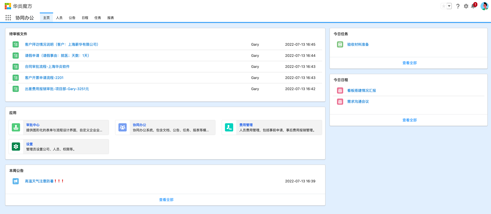
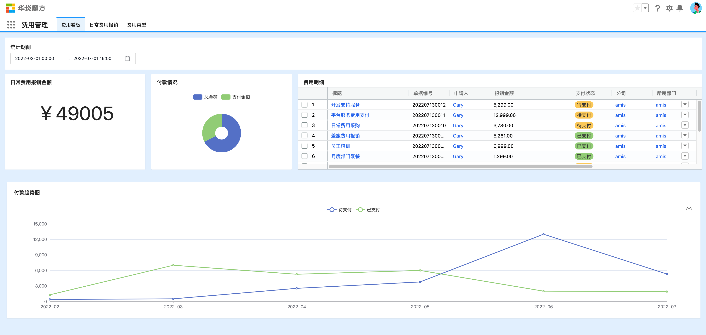

## 启动项目

### 运行Docker

运行以下命令行即可，它包含redis 和 mongodb 服务。

```bash
docker-compose up
```

### 环境变量

如果是在远程开发环境是启动项目，需要新建.env.local文件并配置ROOT_URL为当前环境访问地址。

```
ROOT_URL=https://5000-steedos-steedosexamples-v0diys6e9mj.ws-us75.gitpod.io
```

## 示例效果

amis-dashboard项目提供示例Amis页面配置代码，配置效果如下：

- OA首页



- 数据看板



注意：项目启动后amis页面可能出现跨域问题，需要修改ROOT_URL地址为当前环境访问地址。

## 设计器

### 设计器中查看和调式微页面

微页面元数据是通过代码保存在文件夹 `steedos-app/main/default/pages` 中的，可以通过在设置应用的“用户界面->微页面”界面勾选希望在设计器查看的微页面，然后点击右上角的新建按钮复制新建一条微页面记录，然后在新建好的微页面中点击右上角的设计器即可打开对应微页面的设计器了。

### 设计器中查看和调式查询

微页面中可能会调用查询设计器生成的接口，查询设计器对应的元数据是保存在文件夹 `steedos-app/main/default/queries` 中的，同样可以通过在设置应用的“统计分析->查询”界面勾选希望在设计器查看的查询，然后点击右上角的新建按钮复制新建一条查询记录，然后在新建好的查询中点击右上角的设计器即可打开对应查询的设计器了。